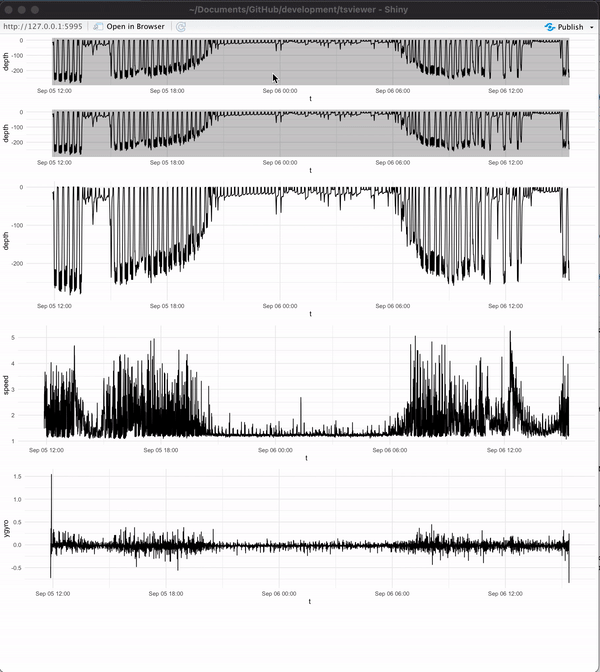

<!-- README.md is generated from README.Rmd. Please edit that file -->

# tsviewer

<!-- badges: start -->
<!-- badges: end -->

`tsviewer` is a time series viewer for auditing tag deployments as part
of the heart rate scaling project. One day I’ll convert it to a
general-purpose tool for tag data…

## Installation

You can install the development version from
[GitHub](https://github.com/) with:

``` r
# install.packages("devtools")
devtools::install_github("FlukeAndFeather/tsviewer")
```

## Example

Load a PRH and launch the tool.

``` r
library(tsviewer)
# Change this to where you keep your PRH NetCDF files. 
path_to_prh <- "/Volumes/GoogleDrive/Shared drives/CATS/tag_data/bw180905-53 (IOS_Monterey)/bw180905-53_prh10.nc"
# catsr is the R package I wrote for the CATS workflow paper (Cade et al. 2021 Animal Biotelemetry)
# read_nc() reads a PRH NetCDF file and returns a standardized data frame
prh <- catsr::read_nc(path_to_prh)
# Launch the tool
run_tsviewer(prh)
```



Use brushing to zoom in on the top two depth profiles. They’re
hierarchical, so use the first one to roughly isolate the period of
interest and use the second one for additional detail.

Clicking on the detail plots (third depth profile, speed, and y-gyro)
shows the time at that point in red.

## Problems

Encounter a problem? Open an
[issue](https://github.com/FlukeAndFeather/tsviewer/issues)!
